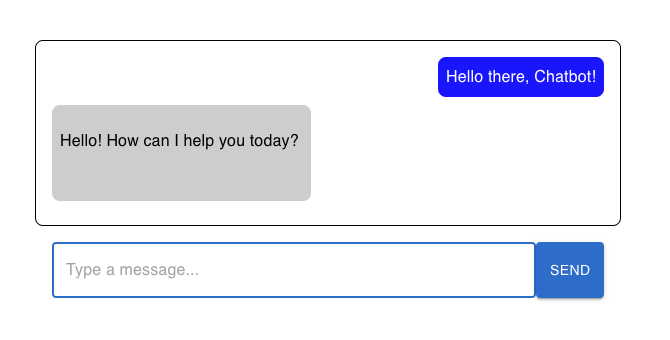

# AI Chatbot
  

  

  ##### Table of Contents  
  [Description](#description)  
  [Deployed App](#deployed-app)   
  [Installation](#installation)  
  [Usage](#usage)  
  [Questions](#questions)  
  [License](#license)  

  ## Description  
  An AI chatbot built using React and Express to test Gemini capabilities and token limitations.

  ## Deployed App  
  Visit https://ai-chatbot-nl47.onrender.com/

  *Note: App is currently on a free tier and may take up to 50 seconds to spin up*

  ## Installation  
  Install dependencies by navigating to root folder and running the following commands
  
 ```
 npm i
 cd client 
 npm i
 ```
  
  Create .env file and add an API_KEY ariable with your Google Gemini API key.
  
  ```
  API_KEY="YourApiKeyHere"
  ```

  ## Usage  
  To use, navigate to root folder. Run the command
   ```
   npm run dev
   ```
A new browser tab should open to application, if not navigate to localhost:3000. 
    
Enter your message in the text input area, and click send to begin your chat.

  ## Questions
  For any questions regarding the repository, contact me via:
  * Github: [dgomie](https://www.github.com/dgomie)
  * Email: <a href="mailto:danny.f.gomez@gmail.com">danny.f.gomez@gmail.com</a>
  
  ## License
  This application is covered under the MIT license  
  https://choosealicense.com/licenses/mit 
